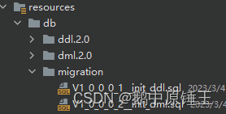

# Flyway


## 1.Flyway是什么？

Flyway是一款开源的数据库版本管理工具，可以实现管理并跟踪数据库变更，支持数据库版本自动升级，而且不需要复杂的配置，能够帮助团队更加方便、合理的管理数据库变更。
例：创建两个sql变更文件，项目启动后会将两个文件中的sql语句全部执行。

## 2.Flyway的工作原理

Flyway在第一次执行时，会创建一个默认名为flyway_schema_history的历史记录表，这张表会用来跟踪或记录数据库的状态，然后每次项目启动时都会自动扫描在resources/db/migration下的文件的版本号并且通过查询flyway_schema_history来判断是否有新增文件，从而判断是否进行迁移。
默认的查找 migration 的路径为 classpath:db/migration ，对应 SQL 文件可放置在src/main/resources/db/migration 下，Java 类可放置在 src/main/java/db/migration 下。
Flyway在第一次执行时，会创建一个默认名为flyway_schema_history的历史记录表，这张表会用来跟
踪或记录数据库的状态，然后每次启动时都会自动扫描在resources/db/migration下的文件并且通过查
询flyway_schema_history来判断是否为新增文件，从而判断是否进行迁移。
默认的查找 migration 的路径为 classpath:db/migration ，对应 SQL 文件可放置在
src/main/resources/db/migration 下，Java 类可放置在 src/main/java/db/migration 下

## 3.Flyway的使用

接下来就进入正题了，flyway该如何使用呢？
以下是Java的使用方式。

1.添加依赖

```xml
<dependency>
	<groupId>org.flywaydb</groupId>
	<artifactId>flyway-core</artifactId>
	<version>6.5.7</version>
</dependency>
```

2. 添加配置

```yaml
java
spring:
  flyway:
    #是否启用
    enabled: true
	# 可以支持多个location, 用','隔开
	locations: classpath:db/migration
	#是否创建元数据表
	validate-on-migrate: true
	# flyway 的 clean 命令会删除指定 schema 下的所有 table, 生产务必禁掉。这个默认值是
	false 理论上作为默认配置是不科学的。
	clean-disabled: true
	# 如果数据库不是空表，需要设置成 true，否则启动报错
	baseline-on-migrate: true
	# 版本控制日志表，默认flyway_schema_history,不同系统建议修改数据
    # table: flyway_schema_history

```

 

3 创建sql文件



4 启动项目即可


## 4.开发时注意事项

1.报错后需要删除flyway_schema_history中记录，否则启动失败
2.V的优先级高于R，假如三个V迁移脚本和一个R(无论新建还是修改)一起执行，其中一个V报错，则V会
全部执行完成且记录到flyway_schema_history中，而R不执行且不记录，删除表中报错记录后，查询启
动，则执行原错误V和未执行的R
3.多个要执行的R中，如果出现了其中一个出现了错误，则在其后的R都不执行
4.R的执行顺序根据命名来进行排序
5.一个文件中ddl并不由一个事务管理，比如创建三个表，中间创建表语句报错，则第一个表还是会创建
成功并且提交事务
6.已经执行过的迁移文件(V)不能修改，否则报错。
7.同一个迁移文件下同表内DDL无法回滚，DML可回滚, 从报错点开始不往下执行，Flyway使用数据库锁
机制
8.版本号相同会报错（Found more than one migration with version 1.0.0.9）
9.同一个迁移文件下假设都是dml，那么如果中间出现错误，所有的dml语句都会回滚
10.删除sql文件后启动会报错，报错如下：

```
If you removed this migration intentionally, run repair to mark the migration as
deleted.

```

## 5.部署上线时注意事项

1.如果不手动创建元数据表，则需要进行以下配置，用于自动创建
validate-on-migrate: true
If you removed this migration intentionally, run repair to mark the migration as
deleted.

2.如果数据库不是空表，则需进行以下配置，否则启动报错
baseline-on-migrate: true

3.clean命令会删除数据库中所有表，包括数据，结构等，这是不合理的，所以需要进行以下配置
clean-disabled: true (该配置由于默认值不合理，所以在V9版本中修改默认值由false为true)

4.使用flyway要注意版本兼容问题，springboot与flyway，flyway与数据库版本，否则启动报错

5.如果启动的时候像忽略某些迁移文件，可进行以下参数配置
baseline-version=20210809，以忽略 20210809 版本以及之前的所有 migration

6.多人开发中，如果一个人提交V2一个人提交V1，而V2先入库执行了，那么V1入库就不会执行，如
果需要执行则需进行如下配置，但是不建议这么做
out-of-order=true

## 6.支持的数据库版本

目前支持mysql5.7的社区版为7.15.0，支持mysql8.0的版本是8.2.0，8.2.1移除了mysql支持，如文档原
文：

```
Extract MySQL code to plugin. This will need to be added as a new dependency.
```


flyway的8.2.1版本移除mysql的解决方案，增加依赖：

 ```xml
 <dependency>
 	<groupId>org.flywaydb</groupId>
 	<artifactId>flyway-mysql</artifactId>
 </dependency>
 
 ```

七、总结
Flyway的引用确实方便了后续我们团队的数据库版本管理，但各个团队使用场景皆有不同，所以本文只供想要学习Flyway的朋友借鉴，另：flyway的社区版同专业版相比也是有一些区别的，类似下面的两个方面，所以在选择Flyway时需考虑引入对整体架构的提升，本文分享到这里结束，感谢大家耐心观看。
①社区版目前不支持版本回退
②社区版本没有任务队列和异步任务的支持，所以在大量变更时略有风险，尽量拆分